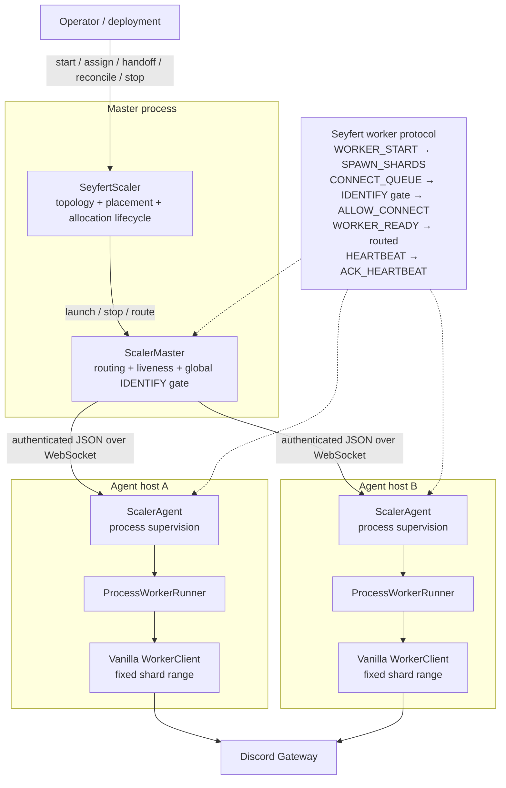
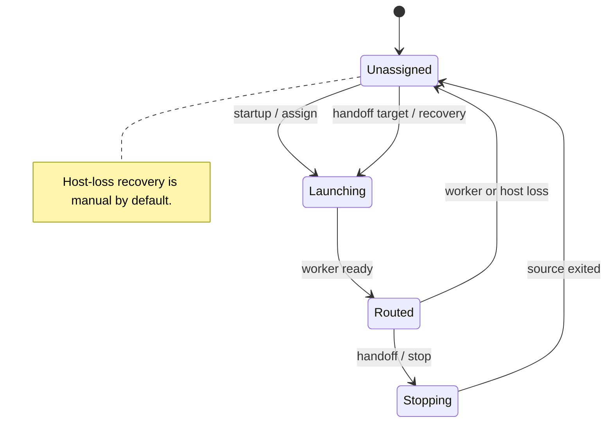

<Callout type="warn" title="Release pending">
The `@slipher/scaler` source has landed in `extra` through [pull request #27](https://github.com/tiramisulabs/extra/pull/27), but the package is not published on npm yet. This guide matches the merged implementation. Do not use it in production until an initial version is published.
</Callout>

`@slipher/scaler` runs vanilla Seyfert `WorkerClient` processes across several machines. Use it when a bot no longer fits on one host and needs explicit placement, sequential rolling deploys, local process supervision, and control-plane restarts without taking every gateway worker down.

It is deliberately smaller than a general-purpose cluster orchestrator. It does not install through `Client({ plugins })`, replace `WorkerManager`, autoscale infrastructure, or change Discord's total shard count.

## Requirements

- Seyfert v5.
- Node.js 22.13 or newer on the master and agent hosts.
- A compiled `WorkerClient` entry that every agent can execute.
- Enough aggregate `maxWorkers` capacity for every logical worker.
- TLS for connections outside loopback, unless the traffic already crosses a trusted encrypted overlay and you explicitly enable insecure transport.

Installation instructions will be added after the package is published.

## Architecture



The **master process** owns the desired topology and placement. `SeyfertScaler` manages logical assignments; `ScalerMaster` authenticates agents, routes messages, monitors hosts, and serializes Discord `IDENTIFY` grants by concurrency bucket.

Each **agent** advertises only a stable `hostId`, a per-process `bootId`, and `maxWorkers`. It supervises child processes locally and reconnects to the master without stopping healthy workers. The default `ProcessWorkerRunner` launches a normal Seyfert cluster worker.

Each **logical worker** owns one immutable contiguous shard range. Placement moves the whole logical worker; individual shards never migrate independently.

## Worker lifecycle



A handoff stops the source before starting the target. This prevents intentional overlap between two processes for the same shards, but creates a bounded Discord event gap while the target starts and identifies.

Allow for the runner's one-second post-close grace, the scaler's 5.5-second launch gate, at least 5.5 seconds between grants in the same Discord `IDENTIFY` bucket, process startup, and Discord `IDENTIFY`/`READY` latency.

## Worker entry

The bot worker is unchanged. Build it to a path available on every agent:

```ts title="src/worker.ts"
import { WorkerClient } from 'seyfert';

const client = new WorkerClient();
await client.start();
```

The scaler supports Seyfert cluster workers with `workerProxy` and total-shard resharding disabled. Use normal REST clients in each worker. Use [`@slipher/redis-adapter`](/docs/recipes/cache) when cache must be shared across hosts.

## Start the master

Resolve the gateway topology once, create the logical workers, and supply a launch factory. The master entry point is exported separately so an agent process does not need to load control-plane-only code.

```ts title="src/master.ts"
import { resolve } from 'node:path';
import {
    createLogicalWorkers,
    createSeyfertLaunch,
    resolveShardTopology,
    ScalerMaster,
    SeyfertScaler,
} from '@slipher/scaler/master';
import { ApiHandler, Client } from 'seyfert';

const botConfig = await new Client().getRC();
const api = new ApiHandler({ token: botConfig.token });
const topology = await resolveShardTopology({
    getGatewayBot: () => api.proxy.gateway.bot.get(),
    shardsPerWorker: 4,
});

const master = new ScalerMaster({
    authToken: process.env.SCALER_TOKEN!,
    host: '127.0.0.1',
    port: 8765,
});

const scaler = new SeyfertScaler({
    master,
    workers: createLogicalWorkers(topology),
    createLaunch: createSeyfertLaunch({
        config: botConfig,
        topology,
        workerPath: resolve('dist/worker.js'),
    }),
});

await scaler.start();
```

`resolveShardTopology()` calls Get Gateway Bot through the callback and uses Discord's recommended shard count unless you provide `totalShards`. `createLogicalWorkers()` divides the selected range into contiguous workers. Its `shardEnd` is exclusive, matching Seyfert's worker topology.

`scaler.start()` opens the master listener, waits until connected agents provide enough aggregate capacity, adopts one compatible observed process per logical worker after a control-plane restart, removes incompatible or duplicate observations, and places anything still unassigned.

<Callout type="warn">
The resolved topology is a startup snapshot. A new Discord shard recommendation requires a separate coordinated reshard; the scaler does not change `totalShards` while running.
</Callout>

## Start an agent

Run one agent process on every host that can receive workers:

```ts title="src/agent.ts"
import { ScalerAgent } from '@slipher/scaler/agent';

const agent = new ScalerAgent({
    hostId: process.env.HOST_ID!,
    host: '127.0.0.1',
    port: 8765,
    authToken: process.env.SCALER_TOKEN!,
    capacity: {
        maxWorkers: Number(process.env.MAX_WORKERS ?? 4),
    },
});

await agent.start();

for (const signal of ['SIGINT', 'SIGTERM'] as const) {
    process.once(signal, () => void agent.stop());
}
```

Keep `hostId` stable for the same machine. The agent creates a new `bootId` for each agent process, which prevents commands intended for an older boot from reaching a replacement.

The default runner is `ProcessWorkerRunner`; provide a custom `WorkerRunner` only when another local supervisor must own child processes. Agent disconnects do not stop healthy workers. Unexpected child exits are respawned locally with capped exponential backoff and a fresh allocation token.

## Remote transport

The master and agents exchange authenticated JSON messages over `ws`, so they may run different supported Node versions. For remote hosts, configure TLS on both sides:

```ts
import { readFileSync } from 'node:fs';
import { ScalerAgent } from '@slipher/scaler/agent';
import { ScalerMaster } from '@slipher/scaler/master';

const master = new ScalerMaster({
    authToken: process.env.SCALER_TOKEN!,
    host: '0.0.0.0',
    port: 8765,
    transport: {
        tls: {
            key: readFileSync(process.env.SCALER_TLS_KEY!),
            cert: readFileSync(process.env.SCALER_TLS_CERT!),
        },
    },
});

const agent = new ScalerAgent({
    hostId: process.env.HOST_ID!,
    host: process.env.SCALER_MASTER_HOST!,
    port: 8765,
    authToken: process.env.SCALER_TOKEN!,
    capacity: { maxWorkers: 4 },
    transport: {
        tls: {
            ca: readFileSync(process.env.SCALER_TLS_CA!),
            servername: process.env.SCALER_TLS_SERVERNAME,
        },
    },
});
```

`authToken` on the master can also be a map from `hostId` to token. `allowInsecureTransport: true` is an explicit opt-in for a trusted private overlay; without TLS or that opt-in, non-loopback connections are rejected.

Continue with [Operations and recovery](/docs/learn/scaling/operations) for placement, rolling deploys, host-loss handling, lifecycle events, and shutdown behavior.
