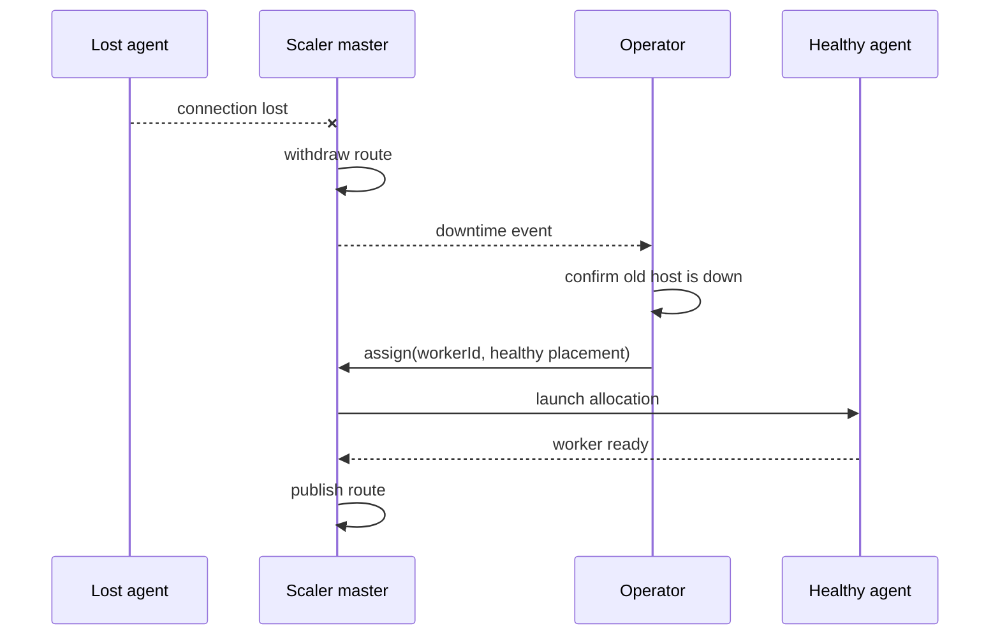

This guide continues from [Distributed scaling](/docs/learn/scaling/distributed) and covers the operational behavior of `@slipher/scaler`.

## Placement

The default `spread` strategy balances the ratio of used slots to `maxWorkers`. Use `placementStrategy: 'fill-first'` to fill earlier connected hosts before using later ones.

Starting another agent only adds capacity. The scaler does **not** automatically move routed workers when a host joins. Perform placement deliberately:

```ts
// Place one unassigned worker using the configured strategy.
await scaler.assign(1);

// Place it on one exact connected agent boot.
await scaler.assign(1, { hostId: 'host-b', bootId: 'host-b-boot' });

// Attempt every unassigned worker and collect failures.
await scaler.reconcile();

// Move a routed worker: stop the source, then launch the target.
await scaler.handoff(0, { hostId: 'host-b', bootId: 'host-b-boot' });
```

`assign()` rejects a routed worker; use `handoff()` for moves. `reconcile()` continues after an individual placement failure, then throws an `AggregateError` containing every failure.

## Rolling deploys

Deploy the new worker artifact to the target host, then hand off workers sequentially. The target can be the same host because the scaler waits for the exact source process to exit before reusing its capacity:

```ts
for (const [workerId, assignment] of scaler.assignments) {
    if (assignment.state !== 'routed') continue;
    await scaler.handoff(workerId, assignment.placement);
}
```

Each handoff creates a bounded event gap while the target process starts and identifies. Deploy workers one at a time when preserving aggregate availability matters.

## Host loss and network partitions

By default, losing a host emits `downtime` and withdraws its routes, but does not start replacements elsewhere. The master cannot distinguish a dead host from a network partition; replacing a partitioned worker could connect the same shards twice and process events or commands twice.

After confirming that the old host is down, recover manually:

```ts
scaler.on('downtime', (workerId, error) => {
    console.error(`Worker ${workerId} is down`, error);
});

await scaler.assign(0, { hostId: 'host-b', bootId: 'host-b-boot' });
await scaler.reconcile();
```

`autoRePlaceOnHostLoss: true` opts into automatic replacement when another host has capacity. It carries the same duplicate-session risk during a partition.



## Events

| Source | Event | Meaning |
| --- | --- | --- |
| `SeyfertScaler` | `assignment` | A logical worker changed placement or lifecycle state. |
| `SeyfertScaler` | `downtime` | A worker exited or its host became unreachable and no route is published. |
| `SeyfertScaler` | `stale` | A worker report or message does not match the current allocation. |
| `SeyfertScaler` | `workerMessage` | The current routed worker sent an application message. |
| `ScalerAgent` | `state` | The control-plane connection became `connecting`, `authenticated`, `disconnected`, or `stopped`. |
| `ScalerAgent` | `workerReady` | A supervised worker reached Seyfert readiness. |
| `ScalerAgent` | `workerExit` | A supervised worker exited. |

Application messages passed through `postMessage()` must be JSON-serializable.

## Environment and shutdown

The process runner gives workers a clean environment rather than inheriting variables such as `PATH` or `HOME` from the agent. Pass every required value explicitly:

```ts
const createLaunch = createSeyfertLaunch({
    config: botConfig,
    topology,
    workerPath,
    env: {
        PATH: '/usr/local/bin:/usr/bin:/bin',
        APP_ENV: 'production',
    },
});
```

In `seyfert.config`, prefer the worker token supplied by the scaler:

```js
token: process.env.SEYFERT_WORKER_TOKEN ?? process.env.BOT_TOKEN ?? ''
```

On shutdown, the runner asks Seyfert to close every shard, waits for acknowledgement, gives in-flight microtasks a one-second grace period by default, then sends `SIGTERM`. It sends `SIGKILL` only when the child still has not exited after the default five-second kill grace.

Use a `SIGTERM` handler for application cleanup that must finish inside that grace:

```ts
process.once('SIGTERM', () => {
    void drainResources().then(
        () => process.exit(0),
        error => {
            console.error(error);
            process.exit(1);
        },
    );
});
```

## Unsupported behavior

- automatic infrastructure scale-up or rebalance when an agent joins;
- changing the total Discord shard count;
- moving individual shards instead of logical workers;
- exactly-once application effects;
- Seyfert `workerProxy` and `WorkerAdapter` manager RPC.

Use normal REST clients inside workers. Choose a shared cache only when state must survive a worker move; process-local cache remains valid when a cold cache after handoff is acceptable.
