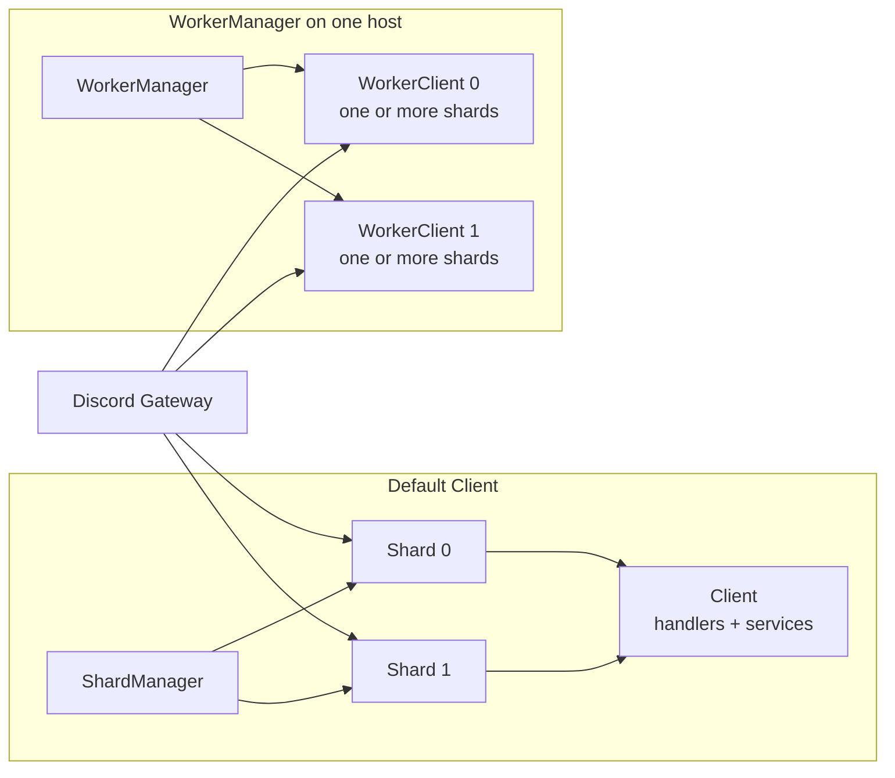
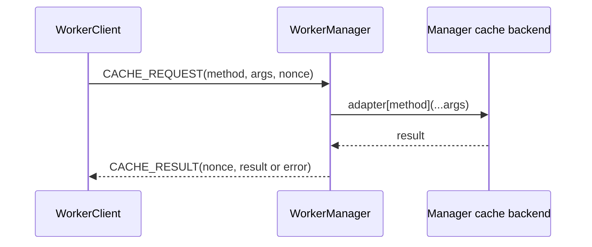

import { Tabs, Tab } from 'fumadocs-ui/components/tabs';

Sharding splits a bot's Discord Gateway traffic across several sessions. Seyfert manages the recommended topology for a normal `Client`; most applications do not need to create or place shards manually.

<Callout title="Sharding is not the same as parallel execution">
A shard is a Gateway connection partition, not a CPU thread or process. `WorkerManager` can place groups of shards in workers when one machine needs execution isolation.
</Callout>

## The execution model



The terms describe different boundaries:

| Term | Responsibility |
| --- | --- |
| Shard | One Discord Gateway session that receives events for a deterministic subset of guilds. |
| `Client` | Manages its shard topology and application services in the current runtime. |
| `WorkerClient` | Runs one assigned shard range inside a worker. |
| `WorkerManager` | Starts and supervises workers on one machine. |
| Scaler host agent | Places and supervises worker processes across machines. |

Every session in one bot deployment must agree on the same total shard count. Discord's recommendation comes from Get Gateway Bot; Seyfert's normal startup path resolves and manages that topology for you.

## Start with Client

For the default topology, start a normal client:

```ts twoslash showLineNumbers
import { Client } from 'seyfert';

const client = new Client();
await client.start();
```

The client's gateway manager exposes topology and latency helpers:

```ts twoslash
import { Client } from 'seyfert';
const client = new Client();
// ---cut---
client.gateway.totalShards;
client.gateway.latency;

const shardId = client.gateway.calculateShardId('1003825077969764412');
await client.gateway.get(shardId)?.ping();
```

Keep this topology until you have a measured reason to isolate execution. Adding workers introduces lifecycle, inter-process communication, and cache-ownership decisions.

## Run workers on one host

`WorkerManager` supports worker threads and Node.js cluster processes. Its `path` must point to the executable worker entry, normally compiled JavaScript.

<Tabs items={['manager.ts', 'worker.ts']}>
    <Tab value="manager.ts">
```ts twoslash showLineNumbers
import { WorkerManager } from 'seyfert';

const manager = new WorkerManager({
    mode: 'threads',
    path: './dist/worker.js',
    shardsPerWorker: 8,
});

await manager.start();
```
    </Tab>
    <Tab value="worker.ts">
```ts twoslash showLineNumbers
import { type ParseClient, WorkerClient } from 'seyfert';

const client = new WorkerClient();
await client.start();

declare module 'seyfert' {
    interface SeyfertRegistry {
        client: ParseClient<WorkerClient<true>>;
    }
}
```
    </Tab>
</Tabs>

Choose the worker mode based on the isolation boundary you need:

| Mode | Boundary | Use it when |
| --- | --- | --- |
| `'threads'` | Worker threads in one Node.js process | Lower overhead and thread-level CPU isolation are enough. |
| `'clusters'` | Separate Node.js processes on one host | Process isolation or independent memory heaps matter. |
| `'custom'` | Your `WorkerAdapter` implementation | Another local worker runtime owns execution. |

`WorkerManager` assigns one or more shards to each worker. `shardsPerWorker` defaults to 8; tune it from observed load rather than assuming one worker per shard. Set it to `16` explicitly if your deployment relies on the previous topology.

## Cache across workers

<Callout type="warn" title="Prefer a shared external adapter">
We do not recommend `WorkerAdapter` as the default cache for a worker deployment. Use a shared adapter such as [`@slipher/redis-adapter`](/docs/recipes/cache) unless you deliberately want one local `WorkerManager` process to own every cache operation.
</Callout>

`WorkerAdapter` is an RPC proxy, not a cache backend. Every `get`, `set`, relationship lookup, and bulk operation follows the same path:



This adds an IPC round trip to every cache operation and makes the manager a required intermediary and failure domain. The manager defaults to `MemoryAdapter`, so that cache is also process-local and is lost when the manager restarts.

The manager catches cache-adapter failures and sends them back in `CACHE_RESULT`. The worker reconstructs the error, including serializable metadata and causes, and rejects the pending operation immediately. `CACHE_TIMEOUT` remains the fallback when no response arrives within 60 seconds.

### Recommended: connect each worker to Redis

Give every worker a Redis adapter connected to the same Redis database. Workers then share one external source of truth without routing cache traffic through `WorkerManager`:

```ts showLineNumbers
import { RedisAdapter } from '@slipher/redis-adapter';
import { type ParseClient, WorkerClient } from 'seyfert';

const client = new WorkerClient();

client.setServices({
    cache: {
        adapter: new RedisAdapter({
            redisOptions: { url: process.env.REDIS_URL! },
        }),
    },
});

await client.start();

declare module 'seyfert' {
    interface InternalOptions {
        asyncCache: true;
    }

    interface SeyfertRegistry {
        client: ParseClient<WorkerClient<true>>;
    }
}
```

`RedisAdapter` uses the `seyfert` namespace by default, so there is no need to coordinate it between workers. Set a custom namespace only when you need to isolate multiple applications that share the same Redis database.

This works across threads, processes, and hosts, and the cache lifecycle is independent from any one worker or manager. If you use `ExpirableRedisAdapter`, keep its process-local `ondemand` cache disabled for data that multiple workers modify unless temporary staleness is acceptable.

### When WorkerAdapter is appropriate

`WorkerAdapter` is reasonable only for the narrower topology it implements:

- every worker runs under one local `WorkerManager`;
- the manager is intentionally the sole cache owner;
- cache traffic is low enough that an IPC round trip per operation is acceptable;
- losing the manager's in-memory state on restart is acceptable, or the manager owns another backend;
- the application accepts the manager and its cache protocol as a shared failure boundary.

In that case, install `WorkerAdapter` in every worker and configure the real backend with `manager.setCache(...)`. Without `setCache`, the manager uses `MemoryAdapter`.

```ts twoslash
import { WorkerAdapter, WorkerClient } from 'seyfert';

const client = new WorkerClient();

client.setServices({
    cache: {
        adapter: new WorkerAdapter(client.workerData),
    },
});

await client.start();
```

<Callout type="warn">
The distributed scaler does not support Seyfert `WorkerAdapter` manager RPC. Workers running on different hosts require a shared external adapter.
</Callout>

## Communicate between workers

`WorkerClient.tellWorker()` executes a serializable callback in one target worker:

```ts twoslash
import { WorkerClient } from 'seyfert';
const client = new WorkerClient();
// ---cut---
const response = await client.tellWorker(
    1,
    (worker, vars) => ({
        respondingWorker: worker.workerId,
        requestedBy: vars.requestedBy,
    }),
    { requestedBy: client.workerId },
);
```

The callback source and `vars` cross a worker boundary. Do not close over local variables; pass required JSON-serializable values through `vars`. Use `tellWorkers()` only when every worker must perform the operation.

## Inspect a worker topology

`Client` and `WorkerClient` expose different helpers:

| Runtime | Useful properties |
| --- | --- |
| `Client` | `client.gateway.totalShards`, `client.gateway.latency`, `client.gateway.get(shardId)`, and `client.gateway.calculateShardId(guildId)` |
| `WorkerClient` | `client.shards`, `client.latency`, `client.calculateShardId(guildId)`, `client.workerId`, `client.tellWorker()`, and `client.tellWorkers()` |

Do not use `client.gateway` in a `WorkerClient`; the worker exposes only its assigned shard range through `client.shards`.

## Scale beyond one host

Threads and clusters stay inside one machine. When the same logical worker topology must run across several hosts, continue with [Distributed scaling](/docs/learn/scaling/distributed).

The scaler moves complete logical workers with fixed shard ranges. It does not change Discord's total shard count or migrate individual shards independently. Changing the total shard count is a coordinated resharding operation, not an ordinary worker placement change.
