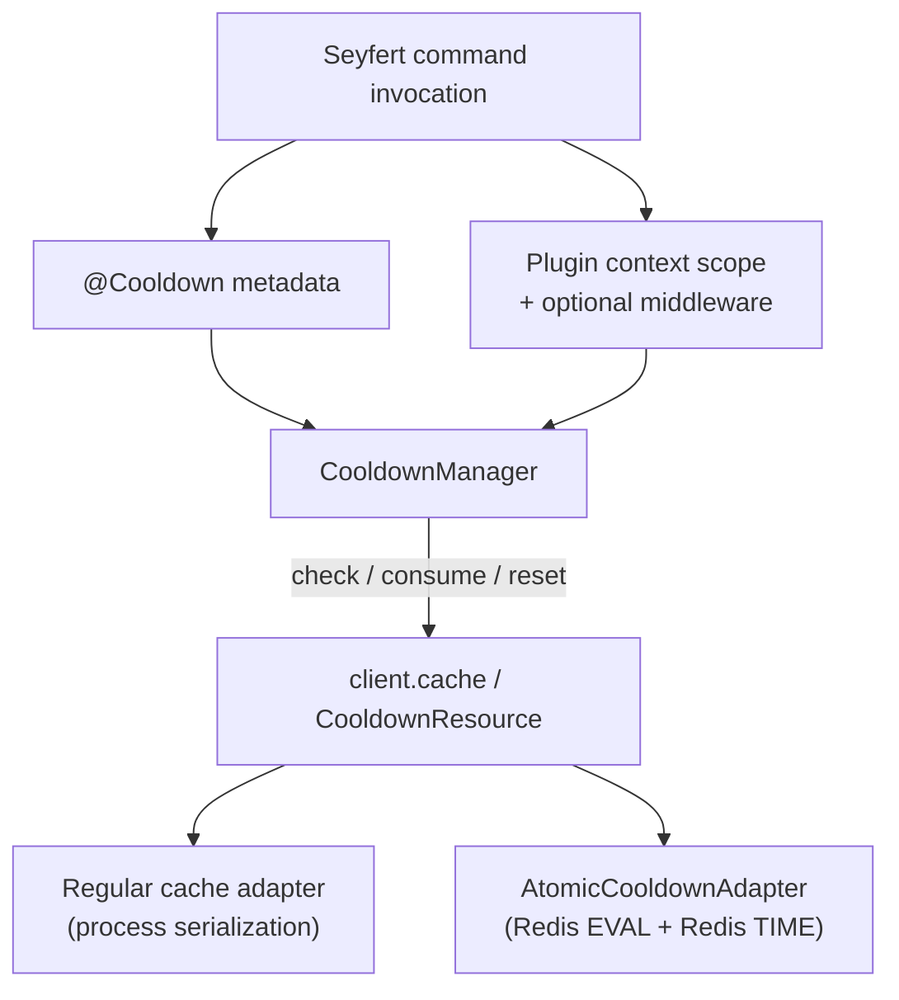

`@slipher/cooldown` adds per-command cooldowns to Seyfert bots. Declare a cooldown with a decorator, let the optional middleware gate commands automatically, or call the manager directly when you need custom behavior. It rate-limits a command per user, guild, channel, or globally, and shared groups let several commands draw from one bucket.

<Callout type="info">
Requires Seyfert v5. The plugin keeps `seyfert` as a peer dependency.
</Callout>

## Installation

```bash copy title="Installing..."
pnpm add @slipher/cooldown
```

## Usage

Install it like any other plugin. The plugin exposes one `CooldownManager` as `client.cooldown` and `ctx.cooldown`, and storage is backed by the client's cache adapter.

```ts
import { Client, definePlugins } from 'seyfert';
import { cooldown } from '@slipher/cooldown';

// build the cooldown plugin and register its default middleware
const plugins = definePlugins(
    cooldown({
        middleware: true,
    }),
);

// teach Seyfert's types about the plugins on this client
declare module 'seyfert' {
    interface SeyfertRegistry { plugins: typeof plugins }
}

// install the plugins into the client
const client = new Client({ plugins });
```

## Declaring cooldowns

Use the decorator shortcut that matches the bucket scope. Each shortcut takes the interval in milliseconds and optional `{ uses, group }`:

```ts
import { Command, type CommandContext, Declare } from 'seyfert';
import { Cooldown } from '@slipher/cooldown';

@Declare({ name: 'ping', description: 'Ping' })
// rate-limit this command to 1 use per user every 5s
@Cooldown.user(5_000) // 1 use per user every 5s
export default class PingCommand extends Command {
    async run(ctx: CommandContext) {
        await ctx.write({ content: 'Pong!' });
    }
}
```

The full set of shortcuts:

```ts
@Cooldown.user(5_000) // bucket per user
@Cooldown.guild(60_000, { uses: 5 }) // bucket per guild, 5 uses per minute
@Cooldown.channel(10_000) // bucket per channel
@Cooldown.global(1_000) // one shared bucket for everyone
@Cooldown.custom((ctx) => `${ctx.guildId}:${ctx.author.id}`, 30_000, { group: 'heavy' }) // bucket keyed by your own resolver
```

Or use the raw `@Cooldown(...)` decorator when you want every field visible:

```ts
import { Command, Declare } from 'seyfert';
import { Cooldown } from '@slipher/cooldown';

@Declare({ name: 'ban', description: 'Ban a member' })
// same cooldown as the shortcuts, with every field spelled out
@Cooldown({
    type: 'user', // scope the bucket per user
    interval: 5_000, // window length in ms
    uses: 3, // allow 3 uses per window
    group: 'moderation', // share the bucket with other 'moderation' commands
})
export default class BanCommand extends Command {}
```

`type` defaults to `'user'` and `uses` defaults to `1`. The props accept:

```ts
interface CooldownProps {
    type?: 'user' | 'guild' | 'channel' | 'global' | ((ctx: AnyContext) => string | undefined);
    interval: number;
    uses?: number;
    group?: string;
}
```

<Callout type="info">
For `guild` and `channel` scopes, DMs fall back to `author.id` because Discord may not provide `guildId` or `channelId` for every interaction. A custom resolver can return `undefined` to skip cooldowns for that invocation.
</Callout>

For subcommands the manager uses `subcommand.cooldown ?? parent.cooldown`, so a parent cooldown applies to its subcommands unless one declares its own.

## Middleware

The middleware is the simplest path: with `cooldown({ middleware: true })` the plugin registers the default `cooldown` middleware at runtime and contributes its type through Seyfert's plugin registry. A decorated command is gated automatically. You can also assign the middleware explicitly by name:

```ts
import { Command, type CommandContext, Declare, Middlewares } from 'seyfert';
import { Cooldown } from '@slipher/cooldown';

@Declare({ name: 'ping', description: 'Ping' })
@Cooldown.user(5_000)
// assign the cooldown middleware to this command by name
@Middlewares(['cooldown'])
export default class PingCommand extends Command {
    async run(ctx: CommandContext) {
        await ctx.write({ content: 'Pong!' });
    }
}
```

When the middleware allows a command it calls `next(result)`, so the command can read the result from `ctx.metadata.cooldown`.

Register it globally when every command should pass through cooldown handling, and customize the denied message with `middleware.message` (a string, or a callback that receives the blocked result and context):

```ts
const plugins = definePlugins(
    cooldown({
        middleware: {
            global: true, // run cooldown handling on every command
            // customize the message shown when a command is blocked
            message: (result, ctx) =>
                `${ctx.author.username}, try again in ${Math.ceil(result.remainingMs / 1000)}s.`,
        },
    }),
);
```

<Callout type="warn">
When you pass `middleware` as an options object (instead of `true`), the runtime middleware is still registered, but the plugin no longer infers the middleware type automatically. Add the name to your app types with `CooldownMiddlewares`:
</Callout>

```ts
import type { CooldownMiddlewares } from '@slipher/cooldown';

// register the middleware type by name, since the options form skips inference
declare module 'seyfert' {
    interface SeyfertRegistry { middlewares: CooldownMiddlewares<'cooldown'> }
}

const plugins = definePlugins(
    cooldown({
        middleware: { global: true },
    }),
);
```

Use the same helper for a custom middleware name:

```ts
import type { CooldownMiddlewares } from '@slipher/cooldown';

// declare the type under your custom middleware name
declare module 'seyfert' {
    interface SeyfertRegistry { middlewares: CooldownMiddlewares<'commandCooldown'> }
}

const plugins = definePlugins(
    cooldown({
        middleware: { name: 'commandCooldown' }, // rename the registered middleware
    }),
);
```

## Manager API

Inside a command, the zero-argument form resolves the active command, target, and guild from Seyfert's context scope:

```ts
import { Command, type CommandContext, Declare } from 'seyfert';
import { Cooldown } from '@slipher/cooldown';

@Declare({ name: 'ping', description: 'Ping' })
@Cooldown.user(5_000)
export default class PingCommand extends Command {
    async run(ctx: CommandContext) {
        // consume one use; context resolves the command, target, and guild
        const result = await ctx.cooldown.consume();

        // bail out when the bucket is exhausted
        if (result && !result.allowed) {
            return ctx.write({
                content: `Try again in ${Math.ceil(result.remainingMs / 1000)}s.`,
            });
        }

        await ctx.write({ content: 'Pong!' });
    }
}
```

Outside a command (admin commands, tests, background jobs) use the explicit form with `name`, `target`, and optional `guildId`:

```ts
// preview the bucket without mutating it
await client.cooldown.check({ name: 'ping', target: userId, guildId });
// consume 2 uses at once via cost
await client.cooldown.consume({ name: 'ping', target: userId, guildId, cost: 2 });
// clear the bucket entirely
await client.cooldown.reset({ name: 'ping', target: userId, guildId });
```

- `check` previews the result without mutating the bucket.
- `consume` decrements the bucket (use `cost` to consume more than one use at once).
- `reset` deletes the bucket and returns `false` when the command has no cooldown.

<Callout type="warn">
Calling the zero-argument form outside a Seyfert handler throws. Use the explicit form there.
</Callout>

## CooldownResult

`check` and `consume` return `undefined` when the command resolves to no cooldown. Otherwise they return a `CooldownResult`:

```ts
type CooldownResult =
    | {
          allowed: true;
          remainingMs: 0;
          retryAfter: Date;
          limit: number;
          remainingUses: number;
          key: string;
      }
    | {
          allowed: false;
          remainingMs: number;
          retryAfter: Date;
          limit: number;
          remainingUses: number;
          key: string;
      };
```

`retryAfter` is a `Date` you can hand straight to `Formatter.timestamp` for a relative message. Asking for a `cost` higher than the bucket limit is a programmer error and throws a `RangeError`.

## Shared buckets

Commands that share a `group` share the same cache key. The shape is `${encodeURIComponent(group ?? resolvedCommandName)}:${typeLabel}:${encodeURIComponent(target)}`. Ordinary Discord IDs remain unchanged, while custom values containing spaces or separators cannot collide:

```ts
import { Command, Declare } from 'seyfert';
import { Cooldown } from '@slipher/cooldown';

@Declare({ name: 'ban', description: 'Ban a member' })
// both commands draw from the shared 'moderation' bucket
@Cooldown.user(5_000, { group: 'moderation' })
export class BanCommand extends Command {}

@Declare({ name: 'kick', description: 'Kick a member' })
@Cooldown.user(5_000, { group: 'moderation' })
export class KickCommand extends Command {}
```

A user that runs `/ban` cannot immediately run `/kick`; both consume `moderation:user:<userId>`. `group` only changes the bucket namespace once a cooldown is resolved; it does not make subcommands inherit cooldowns.

Commands in one group should use the same `type`, `interval`, and `uses`. The command being consumed supplies those settings, so mixing policies inside one shared bucket makes the effective limit depend on call order.

## Architecture



The plugin creates one manager, exposes it as `client.cooldown` and `ctx.cooldown`, and attaches the Seyfert client during `setup`. The optional middleware consumes the active command's bucket before the handler runs. Cache storage remains owned by Seyfert; the adapter decides whether several processes can consume a shared bucket atomically.

## Storage atomicity

`consume` is atomic across processes when the cache adapter explicitly opts in to `AtomicCooldownAdapter` with `supportsAtomicCooldowns: true` and a Redis-compatible `eval(script, keys, args)` method. `RedisAdapter` from `@slipher/redis-adapter` provides that integration starting in v0.0.8. Adapters that merely expose `eval` without the marker use the regular read-decide-write path.

The Redis script uses Redis `TIME` as its clock source and the package's resource key constants. `ExpirableRedisAdapter` deliberately does not opt in because its TTL and relationship bookkeeping are adapter-specific.

<Callout type="info">
For non-atomic async adapters, one manager serializes `consume` and `reset` per bucket key. That prevents overspend inside one process without blocking unrelated buckets, but it cannot coordinate separate processes or replicas. `check` remains a read-only preview and can become stale immediately, so use `consume` as the admission authority.
</Callout>
