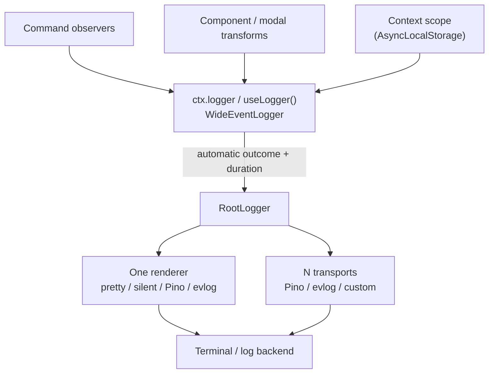

`@slipher/logger` gives every command, component, and modal a single request-scoped **wide event** as `ctx.logger`, emitted automatically when the interaction ends — so an interaction becomes one queryable entry with its outcome, duration, and every field you attached, instead of a scattered pile of log lines. Ordinary level methods (`info`, `warn`, …) still emit immediately, and output flows through a pluggable adapter: a pretty console by default, or Pino / evlog to feed an existing pipeline.

<Callout type="info">
A wide event is one rich, structured entry describing *what happened to this request* — you accumulate context as the work progresses and emit a single event at the end. The plugin manages that lifecycle for you, so on the happy path you never call `emit()` yourself.
</Callout>

## Installation

```sh
pnpm add @slipher/logger
```

Requires Node.js 22.13 or newer and Seyfert v5.

## Usage

Install the plugin once on the client. The `name` becomes a binding that labels every record (it does not rename the plugin, which is always `@slipher/logger`).

```ts
import { Client, definePlugins } from 'seyfert';
import { logger } from '@slipher/logger';

// build the plugin: name labels every record, level sets the floor
const loggerPlugin = logger({
    name: 'slipher-bot',
    level: 'debug',
});
const plugins = definePlugins(loggerPlugin);

// install the plugin into the client
const client = new Client({
    plugins,
});

declare module 'seyfert' {
    interface SeyfertRegistry { plugins: typeof plugins }
}
```

### Options

| Option | Type | Description |
| --- | --- | --- |
| `name` | `string` | A binding that labels every record. It also becomes evlog's `env.service` when the plugin owns evlog initialization. |
| `level` | `LogLevel` | Minimum level to emit: `'trace' \| 'debug' \| 'info' \| 'warn' \| 'error' \| 'fatal' \| 'silent'`. Default `'info'`. |
| `bindings` | `Record<string, unknown>` | Static fields attached to every record. |
| `renderer` | `LoggerAdapter` | The single terminal output. Defaults to `prettyRenderer()`; use `silentRenderer()`, `evlogRenderer()`, or a Pino adapter when another renderer should own the console. |
| `transports` | `LoggerAdapter[]` | Structured sinks that ship entries without owning terminal output. |
| `context` | `AutoContextConfig` | Toggle which Seyfert fields are auto-extracted (see [Auto-extracted context](#auto-extracted-context)). |

## Per-interaction wide events

The plugin attaches a wide-event logger to every command, component, and modal context as `ctx.logger` and drives its lifecycle:

- `onBeforeMiddlewares` / `onBeforeOptions` write immediate `debug` breadcrumbs.
- A middleware that calls `stop()` or `stop(null)` emits **one** wide event with `outcome: 'skipped'`.
- Middleware and permission denials emit **one** wide event with `outcome: 'denied'`; option and runtime failures use `outcome: 'error'`.
- A successful run emits **one** wide event with `outcome: 'success'` and `durationMs` when the command returns.

The result is one canonical entry per interaction.

Collectors and awaited modal callbacks bypass Seyfert's normal component lifecycle, so the plugin scopes them separately. Their wide events include `collector: true`, the originating `command` and `parentInteractionId`, the current interaction identifiers, `waitDurationMs`, and `collectorResult` (`completed` or `error`). Component collectors also include `collectorMatch`.

When OpenTelemetry is active, the collector event receives the collector interaction's native `trace_id` and `span_id`, not the already-ended command span. Calls to `useLogger().add()` inside the callback enrich that same collector event.

### Carry context through middlewares

`ctx.logger.add()` enriches the final wide event; level methods (`info`, `warn`, …) emit immediately. That split keeps normal logging predictable while still producing a single wide event per interaction.

```ts
import { Command, Declare, Middlewares, createMiddleware, type CommandContext } from 'seyfert';

export const auditMiddleware = createMiddleware<{ requestId: string; plan: 'free' | 'pro' }, CommandContext>(
    async ({ context, next }) => {
        const audit = {
            requestId: crypto.randomUUID(),
            plan: await loadUserPlan(context.author.id),
        } as const;

        // enrich the final wide event with these fields
        context.logger.add(audit);
        // pass the context down to the command
        return next(audit);
    },
);

export const middlewares = { audit: auditMiddleware };
client.setServices({ middlewares });

declare module 'seyfert' {
    interface SeyfertRegistry {
        middlewares: typeof middlewares;
    }
}

@Declare({ name: 'deploy', description: 'Deploy the current project' })
@Middlewares(['audit'])
export default class DeployCommand extends Command {
    async run(context: CommandContext<{}, 'audit'>) {
        // add more fields to the same wide event
        context.logger.add({ projectId: 'web', plan: context.metadata.audit.plan });
        // level methods emit their own entry immediately
        context.logger.info('deployment queued');

        await context.write({ content: 'Deployment queued.' });
    }
}
```

You never call `emit()` on the happy path. When the command returns, the plugin emits one wide event with the auto-extracted Seyfert fields, the middleware context, the command context, the outcome, and `durationMs`:

```ts
{
    message: 'command completed',
    kind: 'command',
    command: 'deploy',
    userId: '366779196975874049',
    requestId: '7c5d…',
    plan: 'pro',
    projectId: 'web',
    outcome: 'success',
    durationMs: 42,
}
```

The immediate `info` call is a separate entry:

```ts
{ level: 'info', message: 'deployment queued' }
```

### Auto-extracted context

Every wide event already includes `kind`, `command` or `customId`, `guildId`, `channelId`, `userId`, and `interactionId` — don't add those by hand. Attach anything domain-specific with `ctx.logger.add()` anywhere in the command:

```ts
// attach domain-specific fields anywhere in the command
context.logger.add({ targetId: target.id, reason, banned: true });
```

`shardId` is off by default. Toggle the auto-extracted set with the `context` option:

```ts
// toggle which fields get auto-extracted into every event
logger({ context: { shardId: true, channelId: false } });
```

## Accessing the logger outside a command

In a command, component, or modal handler you already have `ctx.logger`. Everywhere else — helpers, services, event handlers, startup — use `useLogger()` after the plugin is set up and logger ownership is unambiguous. What it returns depends on where you call it:

- `client.logger` remains Seyfert's own logger. This plugin does not replace it with a wide-event logger.
- **Inside an interaction scope** it returns that interaction's wide event — `add()` enriches the same final event as `ctx.logger`, and level methods emit immediately.
- **Outside any scope** it returns a fresh root-backed logger — level methods log immediately, and you can build a one-off wide event by starting it, `add()`-ing context, then `emit()`-ing.

```ts
import { useLogger } from '@slipher/logger';

// immediate log, anywhere
useLogger().info('ready');

// a one-off wide event from, say, an interactionCreate handler
const event = useLogger();
// accumulate context on the captured event
event.add({ source: 'event', interactionId: interaction.id });
// outside a scope you emit the wide event yourself
await event.emit({ message: 'interactionCreate received' });
```

<Callout type="info">
`useLogger()` throws if the plugin has not been set up. If multiple clients own different logger instances, bare `useLogger()` also throws outside an interaction scope; pass the owning client as `useLogger(client)` instead. Outside a scope each call returns a *fresh* event, so capture it in a variable when you intend to `add()` then `emit()`.
</Callout>

For a background job or another unit of work, `withLoggerScope()` creates the wide event, exposes it through `useLogger()`, and emits success or failure automatically:

```ts
import { useLogger, withLoggerScope } from '@slipher/logger';

await withLoggerScope({ kind: 'job', jobId }, async () => {
    const processed = await processJob(jobId);
    useLogger().add({ processed });
}, client); // optional when only one logger is active
```

Because `useLogger()` reads the active scope without requiring an owner argument there, a helper deep in the call stack can enrich the interaction's wide event without being handed the context:

```ts
import { Command, Declare, type CommandContext } from 'seyfert';
import { useLogger } from '@slipher/logger';

async function loadProfile(userId: string) {
    const profile = await db.profiles.find(userId);
    // useLogger() reads the active scope, so this enriches the interaction's event
    useLogger().add({ plan: profile.plan, cached: profile.fromCache });
    return profile;
}

@Declare({ name: 'profile', description: 'Show your profile' })
export default class ProfileCommand extends Command {
    async run(context: CommandContext) {
        const profile = await loadProfile(context.author.id);
        await context.write({ content: `Plan: ${profile.plan}` });
    }
}
```

No `emit()` is called anywhere — when `run()` returns, the plugin emits one wide event that already carries the `plan` and `cached` fields added inside `loadProfile()`.

## Architecture



`register` contributes command observers, handler transforms, and lifecycle defaults. During `setup`, the plugin instruments already-loaded and future handlers and installs its bridge for Seyfert's internal logger. `teardown` flushes every renderer and transport, then restores the previous logger state.

## Renderer and transports

Output has two roles: one `renderer` owns terminal output, while any number of `transports` ship structured records elsewhere. Slipher makes transport configs it owns silent; adapters using externally managed global configuration retain that configuration's output behavior. On field collisions, data from `add()` and level methods wins over bindings.

| Factory | Role |
| --- | --- |
| `prettyRenderer()` | Slipher's default human-readable console. |
| `silentRenderer()` | Disables terminal output. |
| `evlogRenderer(config?)` | Lets evlog print and drain records. |
| `evlogTransport(config?)` | Sends records through evlog drains without duplicating terminal output when Slipher owns the config. |
| `pinoAdapter(instance)` | Wraps a Pino instance for either role, depending on its destination. |

```ts
import {
    evlogRenderer,
    evlogTransport,
    logger,
    silentRenderer,
} from '@slipher/logger';

logger({ name: 'bot' }); // pretty console
logger({ name: 'bot', transports: [evlogTransport(config)] }); // console + evlog drains
logger({ name: 'bot', renderer: evlogRenderer(config) }); // evlog prints and drains
logger({
    name: 'bot',
    renderer: silentRenderer(),
    transports: [evlogTransport(config)],
}); // no terminal output
```

evlog is an optional peer dependency and is imported only by its factories. `pinoAdapter()` accepts a structural `PinoLoggerLike`, so install Pino only when you use it.

### OpenTelemetry trace correlation

When an OpenTelemetry span is active, the logger automatically adds its `trace_id` and `span_id` to every entry before sending it to the renderer and transports. Invalid or missing span contexts are ignored, so applications without tracing keep the same output.

`@opentelemetry/api` is an optional peer dependency. Installing `@slipher/logger` alone does not initialize OpenTelemetry; register `@slipher/opentelemetry` or another SDK in the application to create the active spans used for correlation. The evlog adapter maps these fields to evlog's native `traceId` and `spanId` properties.

Before fan-out, the core serializes every top-level `Error` field, including nested causes and custom enumerable properties. Adapters receive plain objects rather than the original prototypes and identities.

<Callout type="warn">
**Redaction belongs to the sink.** Serialized errors can include SDK request or response metadata. `prettyRenderer()` and custom adapters do **not** redact. Configure sensitive paths in your collector, Pino instance, or evlog config. evlog's built-in patterns (`creditCard`, `email`, `jwt`, …) do **not** cover Discord bot tokens — add a pattern for those.
</Callout>

### Console (default)

`prettyRenderer()` produces colored, multi-line output in development and one JSON object per line when `NODE_ENV=production`. The level is colored, fields are aligned, and an `Error` field is rendered as a real stack trace. Use `silentRenderer()` when nothing should print.

```
19:00:00.123  INFO   [slipher-bot]  command completed
    command      ping
    guildId      1003825077969764412
    durationMs   42ms
19:00:00.130  ERROR  [slipher-bot]  command failed
    command      ban
    SeyfertError: Missing Permissions
        at …
```

### Pino

Install Pino and wrap your own instance with `pinoAdapter`, so any Pino transport or extension works — for example, `pino-pretty` for friendlier development output.

```sh
pnpm add pino
```

```ts
import { Client } from 'seyfert';
import { logger, pinoAdapter } from '@slipher/logger';
import pino from 'pino';

// your own Pino instance owns transports and redaction
const sink = pino({ redact: ['token', 'headers.authorization'] });

// Pino owns terminal output here
const client = new Client({
    plugins: [logger({ name: 'slipher-bot', renderer: pinoAdapter(sink) })],
});
```

For the default Slipher console plus a Pino file destination, put `pinoAdapter(filePino)` in `transports` instead.

### evlog

evlog owns one global pipeline for drains, redaction, sampling, and the service envelope. Pass its config to `evlogTransport()` and Slipher initializes evlog with `silent: true`, derives `env.service` from the logger `name`, and forwards a drain's `flush()` through `client.close()`. Use `evlogRenderer()` instead when evlog should also print.

```sh
pnpm add evlog
```

```ts
import { Client } from 'seyfert';
import { createFsDrain } from 'evlog/fs';
import { createDrainPipeline } from 'evlog/pipeline';
import { evlogTransport, logger } from '@slipher/logger';

// batch records to a filesystem drain
const drain = createDrainPipeline({ batch: { size: 50, intervalMs: 5_000 } })(createFsDrain());

const client = new Client({
    plugins: [
        logger({
            name: 'slipher-bot',
            transports: [
                evlogTransport({
                    env: {
                        environment: process.env.NODE_ENV ?? 'development',
                        version: process.env.npm_package_version,
                    },
                    redact: {
                        paths: ['token', 'headers.authorization'],
                        patterns: [/Bot\s+[A-Za-z0-9._-]+/g],
                    },
                    drain,
                }),
            ],
        }),
    ],
});
```

Any evlog drain works — Axiom, OTLP, Sentry, fs, or your own pipeline. If you call evlog's `initLogger()` yourself, call `evlogTransport()` or `evlogRenderer()` without config; Slipher then leaves the global setup and `silent` choice to you.
