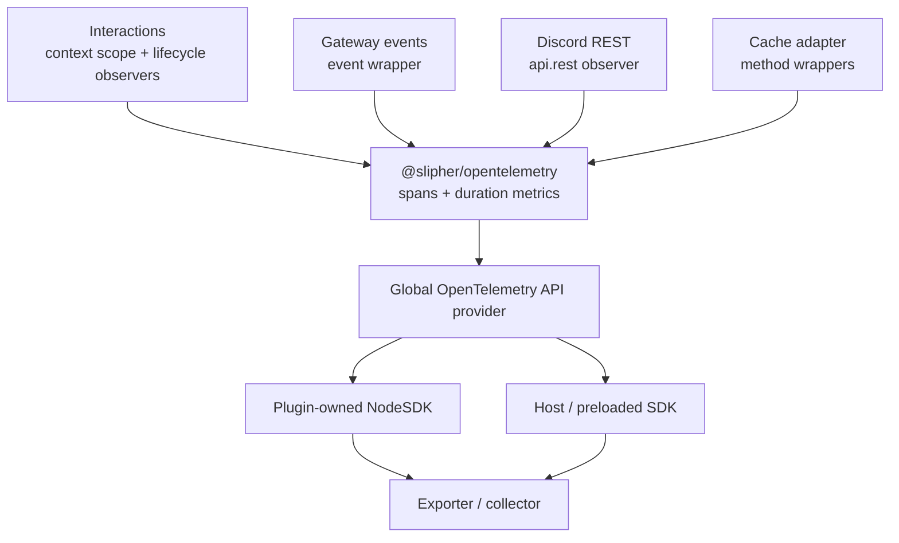

`@slipher/opentelemetry` instruments the main paths through a Seyfert bot and exports standard OpenTelemetry data. Commands, components, modals, gateway events, Discord REST requests, and cache operations become spans with duration histograms alongside them. You can add application-specific child spans through `ctx.trace` without passing a tracer through every layer.

The plugin is backend-neutral. Point it at Jaeger while developing, an OpenTelemetry Collector in production, or any vendor that accepts OTLP.

<Callout type="info">
The plugin requires Seyfert v5. Exporters and processors are intentionally not bundled, so your application chooses where traces and metrics go.
</Callout>

## Installation

Install the plugin, the OpenTelemetry API, and the trace exporter you want to use. This example uses OTLP over HTTP/protobuf:

```sh
pnpm add @slipher/opentelemetry @opentelemetry/api \
  @opentelemetry/sdk-trace-node \
  @opentelemetry/exporter-trace-otlp-proto
```

## Architecture



`register` contributes interaction lifecycle instrumentation, while `setup` installs event, REST, and cache instrumentation and starts a `NodeSDK` only when the process does not already have a real provider. `teardown` removes every wrapper and shuts down the SDK only when the plugin owns it.

## Quick start

Create the plugin once, register the plugin map for type inference, and pass it to the client:

```ts
import { OTLPTraceExporter } from '@opentelemetry/exporter-trace-otlp-proto';
import { BatchSpanProcessor } from '@opentelemetry/sdk-trace-node';
import { opentelemetry } from '@slipher/opentelemetry';
import { Client, definePlugins } from 'seyfert';

const plugins = definePlugins(
	opentelemetry({
		serviceName: 'my-bot',
		spanProcessors: [
			new BatchSpanProcessor(new OTLPTraceExporter()),
		],
	}),
);

declare module 'seyfert' {
	interface SeyfertRegistry {
		plugins: typeof plugins;
	}
}

const client = new Client({ plugins });
await client.start();
```

`serviceName` identifies the bot in your observability backend. If no real tracer provider exists yet, the plugin starts and owns an OpenTelemetry `NodeSDK`. If the process already registered a provider, the plugin reuses it instead.

### See a trace in Jaeger

For a local waterfall view, run Jaeger's all-in-one image with its UI and OTLP/HTTP receiver exposed:

```sh
docker run --rm --name seyfert-jaeger \
  -p 127.0.0.1:16686:16686 \
  -p 127.0.0.1:4318:4318 \
  cr.jaegertracing.io/jaegertracing/jaeger:2.19.0
```

Point the OTLP exporter at it before starting the bot:

```sh
export OTEL_EXPORTER_OTLP_ENDPOINT=http://127.0.0.1:4318
```

Run a command, then open [http://127.0.0.1:16686](http://127.0.0.1:16686), select `my-bot`, and open a trace such as `command ping`. The container uses in-memory storage and loses its traces when it stops; it is intended for local inspection, not production.

See the [Jaeger quick start](https://www.jaegertracing.io/docs/2.19/getting-started/) and [OTLP endpoint configuration](https://opentelemetry.io/docs/languages/sdk-configuration/otlp-exporter/) for other deployment shapes.

## Automatic instrumentation

Every surface is enabled by default and can be switched independently.

| Surface | Span kind | Spans | Duration metric |
| --- | --- | --- | --- |
| Commands, components, and modals | `INTERNAL` | Root span plus `Options`, `Middlewares`, and `Run` lifecycle children | `seyfert.interaction.duration` |
| Gateway events | `INTERNAL` | `event {name}` | `seyfert.event.duration` |
| Discord REST | `CLIENT` | `HTTP {METHOD}` | `seyfert.rest.duration` |
| Cache adapter | `INTERNAL` | `cache {op} {resource}` | `seyfert.cache.operation.duration` |

Disable a noisy or unused surface without removing the plugin:

```ts
opentelemetry({
	serviceName: 'my-bot',
	instrument: {
		interactions: true,
		events: true,
		rest: true,
		cache: false,
	},
});
```

Errors are recorded on their active spans and rethrown to Seyfert. HTTP `4xx` and `5xx` responses are marked as errors, while Seyfert `502`/`503` retries remain part of one logical REST span with `http.request.resend_count` updated.

## Custom spans and attributes

The plugin adds the same request-aware `TraceHandle` to `ctx.trace` and `client.trace`. Inside an interaction, use it to enrich the root span or create a timed child operation:

```ts
import { Command, Declare, type CommandContext } from 'seyfert';

@Declare({ name: 'profile', description: 'Show your profile' })
export default class ProfileCommand extends Command {
	async run(ctx: CommandContext) {
		ctx.trace.setAttributes({ 'app.profile.variant': 'full' });

		const profile = await ctx.trace.record('profile.load', async span => {
			span.setAttribute('app.storage', 'postgres');
			return db.profiles.find(ctx.author.id);
		});

		await ctx.write({ content: `Hello ${profile.name}` });
	}
}
```

`trace.record()` creates an active child span, preserves the callback's synchronous or asynchronous return type, ends the span automatically, and records rejected or thrown errors before rethrowing them.

The handle exposes:

| Member | Behavior |
| --- | --- |
| `span` | Current active span, or `undefined` outside a traced scope. |
| `setAttributes(attributes)` | Adds attributes to the current span and returns whether a span was available. |
| `recordException(error)` | Records an exception on the current span when one exists. |
| `record(name, callback)` | Runs the callback inside an automatically ended child span. |

`createTraceHandle` and its `TraceHandle` type are also exported for custom integrations.

For services that do not have a Seyfert context, import the module helpers:

```ts
import {
	getCurrentSpan,
	getMeter,
	getTracer,
	record,
	setAttributes,
	startActiveSpan,
	startSpan,
} from '@slipher/opentelemetry';

await record('billing.lookup', async span => {
	span.setAttribute('app.plan', 'pro');
	await loadSubscription();
});

setAttributes({ 'app.cache': 'hit' });
getCurrentSpan()?.addEvent('profile-ready');

const manual = startSpan('detached-work');
manual.end();

const meter = getMeter();
const tracer = getTracer();
```

`record` and `startActiveSpan` end spans automatically. A span created with `startSpan` is manual and must be ended by your code.

## Filtering

`checkIfShouldTrace` runs before an automatic root span is created. It receives a discriminated `TraceSource`, so filtering can stay specific to the surface:

```ts
opentelemetry({
	checkIfShouldTrace(source) {
		if (source.kind === 'event') {
			return source.name !== 'RAW' && !source.name.startsWith('RAW_');
		}

		if (source.kind === 'rest') {
			return source.path !== '/gateway/bot';
		}

		return true;
	},
	cache: {
		skipResources: ['presence', 'voice_state', 'messages'],
	},
});
```

The source variants are:

```ts
type TraceSource =
	| { kind: 'command' | 'component' | 'modal'; context: unknown }
	| { kind: 'event'; name: string; args: readonly unknown[] }
	| { kind: 'rest'; method: string; path: string }
	| { kind: 'cache'; op: string; resource: string };
```

`presence` and `voice_state` cache resources are skipped by default because they are high-churn. Passing `cache.skipResources` replaces that default set.

## Options

`OpenTelemetryPluginOptions` also accepts `NodeSDK` options such as `spanProcessors`, `traceExporter`, `metricReader`, `instrumentations`, `resource`, and `sampler`.

| Option | Default | Description |
| --- | --- | --- |
| `serviceName` | `'seyfert'` | Tracer and meter name; also the resource service name when the plugin owns the SDK. |
| `instrument` | All surfaces enabled | Enables or disables interactions, events, REST, and cache independently. |
| `checkIfShouldTrace` | Always `true` | Filters automatic root spans before recording begins. |
| `contextManager` | OpenTelemetry default | A `ContextManager` registered only when no global context manager is active. |
| `cache.skipResources` | `['presence', 'voice_state']` | Cache namespaces that should never produce spans or duration metrics. |
| NodeSDK options | — | Used only when this plugin starts the SDK. |

Plugin identity remains `@slipher/opentelemetry`; changing `serviceName` does not rename the plugin.

## Attributes

Attributes are added only when the relevant value exists.

### Interactions

| Attribute | Description |
| --- | --- |
| `seyfert.interaction.kind` | `command`, `component`, or `modal`. |
| `seyfert.command` | Full command name when known. |
| `seyfert.custom_id` | Component or modal custom ID, truncated to 64 characters. |
| `seyfert.guild_id` | Guild ID. |
| `seyfert.channel_id` | Channel ID. |
| `seyfert.user_id` | Invoking user ID. |
| `seyfert.interaction_id` | Interaction ID. |
| `seyfert.shard_id` | Shard ID when present. |

Root span names are `command {name}`, `component {customId}`, and `modal {customId}`. Lifecycle children are `Options` for commands, `Middlewares`, and `Run`.

### Gateway events

| Attribute | Description |
| --- | --- |
| `seyfert.event.name` | Event name, such as `MESSAGE_CREATE`. |
| `seyfert.shard_id` | Shard ID when present. |

The span name is `event {name}`.

### Discord REST

| Attribute | Description |
| --- | --- |
| `http.request.method` | HTTP method. |
| `url.path` | URI path with query strings omitted and Discord webhook or interaction tokens redacted. |
| `url.template` | Low-cardinality Discord route template, such as `/channels/:id/messages`. |
| `http.response.status_code` | Response status when known. |
| `http.request.resend_count` | Seyfert `502`/`503` resend count. |
| `error.type` | HTTP status or exception type for failed operations. |

The span name is `HTTP {METHOD}`. HTTP `4xx`/`5xx` responses and thrown client failures set span status to `ERROR`.

### Cache

| Attribute | Description |
| --- | --- |
| `seyfert.cache.op` | Seyfert adapter method, including bulk and relationship operations. |
| `seyfert.cache.resource` | Resource namespace derived from the key. |
| `seyfert.cache.hit` | Whether a `get` result was non-nullish. |

The span name is `cache {op} {resource}`. High-churn resources `presence` and `voice_state` are skipped by default.

Component and modal `custom_id` values are intentionally included on interaction metrics. Guild, channel, user, and interaction IDs remain span-only so metric dimensions do not grow with every Discord entity.

## Metrics

Every duration histogram uses seconds and adds `seyfert.error` when the operation fails. Instruments are created only for enabled `instrument.*` surfaces.

| Instrument | Typical attributes |
| --- | --- |
| `seyfert.interaction.duration` | Interaction kind, command or custom ID when known, shard, and `seyfert.error`. |
| `seyfert.event.duration` | Event name and `seyfert.error`. |
| `seyfert.rest.duration` | Method, URL template, status, and `seyfert.error`. |
| `seyfert.cache.operation.duration` | Operation, resource, cache hit when applicable, and `seyfert.error`. |

A metric reader is required to export them. For a quick local check use `ConsoleMetricExporter`; in production, configure an OTLP metric exporter or another reader supported by the OpenTelemetry SDK. Custom metrics created through `getMeter()` use the same global meter provider.

## Privacy and cardinality

The REST instrumentor never captures request or response bodies, bot tokens, authorization headers, or cookies. Query strings are omitted, Discord webhook and interaction tokens are replaced with `REDACTED`, and metrics use route templates such as `/channels/:id/messages` instead of raw IDs.

IDs and custom IDs can still be sensitive in your application domain. Use `checkIfShouldTrace` to exclude interactions or paths that must not appear in telemetry, and apply any additional redaction or sampling in your collector.

<Callout type="warn">
The plugin's REST correlation uses a FIFO queue for concurrent requests with the same method and exact path because Seyfert observer payloads do not expose a request ID. If those requests finish out of order, status and duration may be attached to the wrong span. Requests to different paths are unaffected.
</Callout>

## Using an existing SDK

If the host process already registered a real tracer provider, the plugin does not start another `NodeSDK`. Automatic instrumentation, `ctx.trace`, and module helpers use that global provider, while SDK-specific options passed to the plugin are ignored. Configure processors, exporters, resources, and metric readers on the host-owned SDK instead.

In that host-owned case the plugin never calls `NodeSDK.start()` or `sdk.shutdown()`. It still unwraps REST, cache, and event instrumentation during teardown.

When the plugin owns the SDK, teardown flushes and shuts it down. Teardown is terminal for that plugin instance: create a new `opentelemetry(...)` instance with fresh processors and exporters before starting a new client lifecycle. The plugin works alongside `@slipher/logger`; logs and traces remain independent signals.
