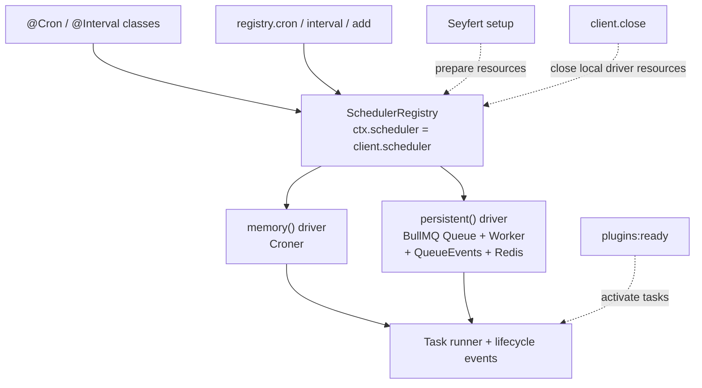

`@slipher/scheduler` lets you run recurring work — cron jobs, intervals, heartbeats, cleanups — from inside the Seyfert lifecycle. You define tasks with `@Cron`/`@Interval` decorators or registry calls, pick a driver (in-process or BullMQ/Redis), and reach the scheduler through `ctx.scheduler` or `client.scheduler`.

## Installation

```sh
pnpm add @slipher/scheduler
```

Requires Seyfert v5. The persistent driver uses BullMQ job schedulers, so install BullMQ only when you need cluster-aware, restart-surviving schedules:

```sh
pnpm add bullmq@^5.23.0
```

## Usage

Tasks live on a single **registry**. A **driver** decides where they run: `memory()` runs them in the current process; `persistent()` runs them on BullMQ/Redis so they survive restarts and coordinate across replicas — the task code is the same either way.

Define tasks as decorated classes, build the plugin with a driver, and register it on the client:

```ts
import { Client, definePlugins } from 'seyfert';
import { Interval, memory, scheduler } from '@slipher/scheduler';

class MaintenanceTasks {
	// run this method every 5 minutes
	@Interval('5m', { id: 'heartbeat' })
	heartbeat() {
		// run work
	}
}

// build the plugin with an in-process driver and the task classes
const schedulerPlugin = scheduler({
	driver: memory(),
	tasks: [MaintenanceTasks],
});
const plugins = definePlugins(schedulerPlugin);

declare module 'seyfert' {
	interface SeyfertRegistry { plugins: typeof plugins }
}

// install the plugin into the client
export const client = new Client({ plugins });
```

Once registered, the plugin exposes `ctx.scheduler` and `client.scheduler`. The Seyfert lifecycle handles setup for you when the client starts, and teardown when it closes.

### Defining tasks with decorators

Decorate methods with `@Cron` (a cron expression) or `@Interval` (a duration). The `ScheduledTask` passed to your method carries the task's runtime state:

```ts
import { Cron, Interval, type ScheduledTask } from '@slipher/scheduler';

class Tasks {
	// run every day at 09:00 Santo Domingo time and skip overlapping ticks
	@Cron('0 9 * * *', {
		id: 'morning-report',
		timezone: 'America/Santo_Domingo',
		overlap: 'skip',
	})
	report(task: ScheduledTask) {
		return task.id;
	}

	// run every hour, and also once after every plugin is ready
	@Interval('1h', { id: 'heartbeat', runImmediately: true })
	heartbeat() {}
}
```

`runImmediately: true` runs the task once when the scheduler activates from `plugins:ready`, then on its normal schedule.
Every task exposes its effective `overlap` policy, and cron tasks expose their `timezone`; both values are also included in `task.snapshot()`.

<Callout type="info">
With `persistent()`, every decorated task must provide an explicit non-empty `id`. Method names are allowed as defaults with `memory()`, but persistent task ids are Redis scheduler ids — renaming a method without a stable `id` orphans the old Redis schedule and creates a new one.
</Callout>

### Durations and cron

`@Interval` and `registry.interval(...)` accept a duration: a number of milliseconds, or a string like `'30s'`, `'5m'`, `'1h'`, `'1d'`. Compound forms such as `'1h30m'` work too. `@Cron` and `registry.cron(...)` accept a standard cron expression. `registry.add(...)` accepts either and resolves the right kind automatically.

```ts
// schedule an interval task imperatively, by id and duration
ctx.scheduler.interval('refresh-cache', '30s', async task => {
	void task.runCount;
});

// schedule a cron task imperatively
ctx.scheduler.cron(
	'daily-cleanup',
	'0 0 * * *',
	async () => {
		// run work
	},
	{ timezone: 'America/Santo_Domingo' },
);
```

<Callout type="info">
`memory()` intervals tick at 1-second resolution. Sub-second values like `'500ms'` parse, but Croner rounds them up to the next whole-second tick.
</Callout>

### Timezones and overlapping runs

Cron tasks accept a `timezone` through `@Cron(...)` or `registry.cron(...)`. The memory driver passes it to Croner, while the persistent driver passes it to BullMQ as `tz`. Interval tasks do not accept a timezone because their schedule is a relative duration.

Tasks use `overlap: 'allow'` by default. With `memory()`, set `overlap: 'skip'` when a new tick should be ignored while the previous run is still pending:

```ts
ctx.scheduler.interval(
	'refresh-cache',
	'30s',
	async () => {
		// refresh shared state
	},
	{ overlap: 'skip' },
);
```

A skipped tick emits `skipped` with `{ task, reason: 'overlap' }` and does not increment `runCount`. The memory driver delegates exclusion to Croner's `protect` mechanism instead of adding a second scheduler lock.

<Callout type="warn">
The persistent driver rejects `overlap: 'skip'` before registering the task because BullMQ does not provide that per-task exclusion guarantee across replicas. Coordinate overlap inside the task when using `persistent()`.
</Callout>

Task failures still emit `failed`. The memory driver settles the rejected Croner callback after emitting the event, preventing an unhandled rejection and allowing Croner to release its internal running state.

### Scheduling from a command

`ctx.scheduler` is the same registry — schedule, pause, or remove tasks from any command, component, or modal:

```ts
import { Command, Declare, type CommandContext } from 'seyfert';

@Declare({
	name: 'refresh-cache',
	description: 'Schedule a cache refresh',
})
export default class RefreshCacheCommand extends Command {
	async run(ctx: CommandContext) {
		// schedule a task straight from the command via ctx.scheduler
		ctx.scheduler.interval('refresh-cache', '30s', async task => {
			void task.id;
		});

		await ctx.write({ content: 'Cache refresh scheduled.' });
	}
}
```

### Accessing the scheduler

`ctx.scheduler`, `client.scheduler`, and the plugin's `registry` are the same object.

| Where | How |
| --- | --- |
| Command, component, modal | `ctx.scheduler` |
| Event | `entity.client.scheduler` |
| Anywhere with the client | `client.scheduler` |
| Code with no client | capture the plugin's `registry` |

For code that has no client and no `ctx`, capture the `registry` at composition time:

```ts
// index.ts
const schedulerPlugin = scheduler({ driver: memory(), tasks: [MaintenanceTasks] });
const plugins = definePlugins(schedulerPlugin);
// export the registry so non-client code can reach the scheduler
export const registry = schedulerPlugin.registry;
export const client = new Client({ plugins });

// services/reports.ts
import { registry } from '../index';

export function pauseReports() {
	// pause a task by id without needing the client or a ctx
	return registry.pause('morning-report');
}
```

<Callout type="warn">
Avoid importing the exported `client` from task modules loaded by `index.ts` — that creates a circular import. Capturing the `registry` at composition time avoids it.
</Callout>

The registry also offers `get(id)`, `list()`, `snapshot()`, `pause(id)`, `resume(id)`, and `remove(id)` for managing registered tasks at runtime. `removeOrphan(id)` removes a persistent scheduler that no longer has a registered task.

## Architecture



The plugin creates one registry and exposes it through `ctx`, the client, and the plugin instance. `setup` prepares driver resources so connection failures reject `client.start()`. Tasks activate only from Seyfert's `plugins:ready` hook, after every plugin completes setup, and `teardown` closes the driver.

## Drivers

### `memory()`

`memory()` uses Croner in the current process — ideal for local workers and single-process jobs. Jobs stay paused until setup, so tasks can't fire before the Seyfert client/plugin lifecycle is ready.

### `persistent()`

`persistent()` uses BullMQ job schedulers so repeated jobs are coordinated outside a single process:

```ts
import { Client, definePlugins } from 'seyfert';
import { persistent, scheduler } from '@slipher/scheduler';

const schedulerPlugin = scheduler({
	// run schedules on BullMQ/Redis so they survive restarts and coordinate replicas
	driver: persistent({
		connection: { host: '127.0.0.1', port: 6379 },
		queueName: 'scheduler',
		prefix: 'slipher',
	}),
	tasks: [MaintenanceTasks],
});
const plugins = definePlugins(schedulerPlugin);

declare module 'seyfert' {
	interface SeyfertRegistry { plugins: typeof plugins }
}

const client = new Client({ plugins });

// setup prepares resources; plugins:ready activates task execution
await client.start();
```

Starting the client prepares Redis/BullMQ resources during plugin setup. Tasks activate from Seyfert's `plugins:ready` hook after every plugin finishes setup. `client.close()` stops local processing and releases the Worker, QueueEvents, and Queue resources; persistent scheduler definitions remain in Redis until you pause or remove them. Wire shutdown to your process signals:

```ts
process.on('SIGTERM', () => {
	// tear down the schedules and release Redis/BullMQ resources on shutdown
	void client.close().then(() => process.exit(0));
});
```

<Callout type="warn">
Removing a persistent task from code is **not** enough — the Redis schedule keeps firing until the orphan is removed explicitly with `registry.removeOrphan('old-task-id')`. On startup the driver compares Redis job schedulers against registered tasks and warns about orphans; pass `persistent({ purgeOrphansOnStartup: true })` to delete them during setup. `remove(id)` remains for tasks still registered in the current registry.
</Callout>

With `persistent()`, `pause(id)` removes the BullMQ job scheduler and `resume(id)` re-creates it from the captured template. `start(id)` remains a compatibility alias for `resume(id)`.

`runImmediately: true` runs the task once when the scheduler activates, then on its normal schedule. Persistent drivers deduplicate immediate jobs across replicas that start within the same 60-second window. Configure a different positive window when needed:

```ts
persistent({
	connection,
	immediateRunDeduplicationMs: 30_000,
});
```

A restart inside that window belongs to the same deployment wave and does not enqueue another immediate run. A restart after the window expires starts a new wave.

## Programmatic usage

You can use the registry without the Seyfert plugin via `createScheduler`. Register tasks, then call `setup()` yourself (the plugin does this for you when the client starts):

```ts
import { createScheduler, memory } from '@slipher/scheduler';

// create a standalone registry, no Seyfert plugin involved
const registry = createScheduler({ driver: memory() });

// register a cron task
registry.cron('daily-cleanup', '0 0 * * *', async () => {
	// run work
});

// add() resolves cron vs. interval from the value automatically
registry.add('poller', '10s', async task => {
	void task.runCount;
});

// start the scheduler yourself, since there's no client lifecycle
await registry.setup();
```

## Events

Each task emits lifecycle events through the registry. Listen with `on` (returns an unsubscribe function) or `once`:

```ts
// listen for a task finishing successfully (on returns an unsubscribe fn)
registry.on('completed', ({ task, result }) => {
	void task.id;
	void result;
});

// listen for a task throwing
registry.on('failed', ({ task, error }) => {
	void task.id;
	void error;
});

// observe a memory tick omitted by overlap protection
registry.on('skipped', ({ task, reason }) => {
	void task.id;
	void reason; // 'overlap'
});
```

Supported events: `scheduled`, `started`, `completed`, `failed`, `skipped`, `paused`, `resumed`, `removed`, and `error`. Persistent BullMQ resources emit `error` with `{ source, error }`, where `source` is `queue`, `queue-events`, or `worker`; transport errors are also sent to the configured logger.

<Callout type="info">
With `memory()`, events are in-process. With `persistent()`, the worker emits lifecycle events immediately in the replica running the task, while BullMQ `QueueEvents` mirrors the same outcome to other replicas without duplicating it locally. `QueueEvents` uses one extra Redis connection per scheduler queue per replica. Listener errors are isolated and reported through the configured logger.
</Callout>
