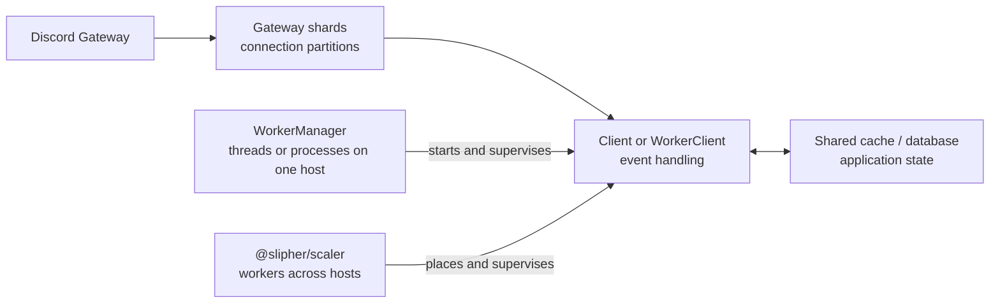

Scaling a Seyfert application involves three separate concerns: splitting Discord Gateway traffic into shards, deciding where those shards execute, and deciding where shared application state lives. Treating them separately keeps a larger deployment understandable.

<Callout title="Most bots can start with Client">
`Client` manages Discord's recommended shard topology internally. Add `WorkerManager` when one machine needs thread or process isolation, and reach for `@slipher/scaler` only when workers must run across multiple hosts.
</Callout>

## The scaling layers

A **shard** is a Discord Gateway connection responsible for a deterministic subset of guilds. A **worker** is a local execution unit that can own one or more shards. A **host** is a machine that can run one or more workers. Increasing one of these counts does not automatically increase the others.

## Choose the smallest useful topology

| Need | Start with | What it changes |
| --- | --- | --- |
| Run a typical bot with Discord's recommended topology | `Client` | Seyfert manages gateway shards in the current runtime. |
| Isolate work across CPU threads on one machine | `WorkerManager` with `mode: 'threads'` | Runs `WorkerClient` instances in worker threads. |
| Isolate work across processes on one machine | `WorkerManager` with `mode: 'clusters'` | Runs `WorkerClient` instances in Node.js cluster processes. |
| Place and recover workers across several machines | `@slipher/scaler` | Adds a master and host agents around vanilla `WorkerClient` processes. |

More workers can improve isolation and concurrency, but do not reduce Discord's shard count. More shards split gateway traffic, but do not make CPU-heavy handlers parallel inside a single runtime. A shared cache or database is a separate decision based on which state must be visible across workers or survive a move.

## Read in order

<Cards>
    <Card title="Understanding sharding" href="/docs/scaling/sharding">
        Learn what Discord shards are, how `Client` manages them, and when to introduce `WorkerManager`.
    </Card>
    <Card title="Distributed scaling" href="/docs/scaling/distributed">
        Configure the work-in-progress `@slipher/scaler` master and agents for several hosts.
    </Card>
    <Card title="Operations and recovery" href="/docs/scaling/operations">
        Plan placement, rolling deploys, host-loss recovery, events, and graceful shutdown.
    </Card>
</Cards>
