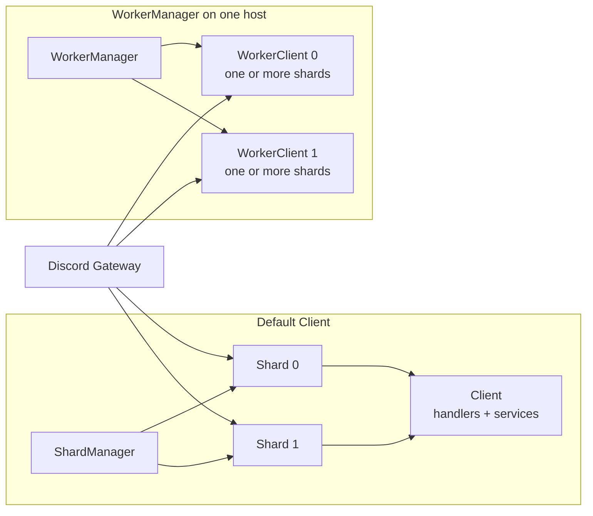

import { Tabs, Tab } from 'fumadocs-ui/components/tabs';

Sharding splits a bot's Discord Gateway traffic across several sessions. Seyfert manages the recommended topology for a normal `Client`; most applications do not need to create or place shards manually.

<Callout title="Sharding is not the same as parallel execution">
A shard is a Gateway connection partition, not a CPU thread or process. `WorkerManager` can place groups of shards in workers when one machine needs execution isolation.
</Callout>

## The execution model



The terms describe different boundaries:

| Term | Responsibility |
| --- | --- |
| Shard | One Discord Gateway session that receives events for a deterministic subset of guilds. |
| `Client` | Manages its shard topology and application services in the current runtime. |
| `WorkerClient` | Runs one assigned shard range inside a worker. |
| `WorkerManager` | Starts and supervises workers on one machine. |
| Scaler host agent | Places and supervises worker processes across machines. |

Every session in one bot deployment must agree on the same total shard count. Discord's recommendation comes from Get Gateway Bot; Seyfert's normal startup path resolves and manages that topology for you.

## Start with Client

For the default topology, start a normal client:

```ts twoslash showLineNumbers
import { Client } from 'seyfert';

const client = new Client();
await client.start();
```

The client's gateway manager exposes topology and latency helpers:

```ts twoslash
import { Client } from 'seyfert';
const client = new Client();
// ---cut---
client.gateway.totalShards;
client.gateway.latency;

const shardId = client.gateway.calculateShardId('1003825077969764412');
await client.gateway.get(shardId)?.ping();
```

Keep this topology until you have a measured reason to isolate execution. Adding workers introduces lifecycle, inter-process communication, and cache-ownership decisions.

## Run workers on one host

`WorkerManager` supports worker threads and Node.js cluster processes. Its `path` must point to the executable worker entry, normally compiled JavaScript.

<Tabs items={['manager.ts', 'worker.ts']}>
    <Tab value="manager.ts">
```ts twoslash showLineNumbers
import { WorkerManager } from 'seyfert';

const manager = new WorkerManager({
    mode: 'threads',
    path: './dist/worker.js',
    shardsPerWorker: 8,
});

await manager.start();
```
    </Tab>
    <Tab value="worker.ts">
```ts twoslash showLineNumbers
import { type ParseClient, WorkerClient } from 'seyfert';

const client = new WorkerClient();
await client.start();

declare module 'seyfert' {
    interface SeyfertRegistry {
        client: ParseClient<WorkerClient<true>>;
    }
}
```
    </Tab>
</Tabs>

Choose the worker mode based on the isolation boundary you need:

| Mode | Boundary | Use it when |
| --- | --- | --- |
| `'threads'` | Worker threads in one Node.js process | Lower overhead and thread-level CPU isolation are enough. |
| `'clusters'` | Separate Node.js processes on one host | Process isolation or independent memory heaps matter. |
| `'custom'` | Your `WorkerAdapter` implementation | Another local worker runtime owns execution. |

`WorkerManager` assigns one or more shards to each worker. `shardsPerWorker` defaults to 16; tune it from observed load rather than assuming one worker per shard.

## Cache across workers

A worker does not use the manager's in-memory cache directly. `WorkerAdapter` forwards cache operations from `WorkerClient` to the backend registered on `WorkerManager`.

```ts twoslash
import { WorkerAdapter, WorkerClient } from 'seyfert';

const client = new WorkerClient();

client.setServices({
    cache: {
        adapter: new WorkerAdapter(client.workerData),
    },
});

await client.start();
```

The manager uses its configured cache adapter as the source of truth; its default backend is `MemoryAdapter`. Register a shared adapter on the manager when state must also be visible outside that manager process. See [Caching](/docs/recipes/cache) for the available cache patterns.

<Callout type="warn">
`WorkerAdapter` is manager RPC, not a multi-host cache. The distributed scaler does not support Seyfert `WorkerAdapter` manager RPC; use a shared external adapter when workers run on different machines.
</Callout>

## Communicate between workers

`WorkerClient.tellWorker()` executes a serializable callback in one target worker:

```ts twoslash
import { WorkerClient } from 'seyfert';
const client = new WorkerClient();
// ---cut---
const response = await client.tellWorker(
    1,
    (worker, vars) => ({
        respondingWorker: worker.workerId,
        requestedBy: vars.requestedBy,
    }),
    { requestedBy: client.workerId },
);
```

The callback source and `vars` cross a worker boundary. Do not close over local variables; pass required JSON-serializable values through `vars`. Use `tellWorkers()` only when every worker must perform the operation.

## Inspect a worker topology

`Client` and `WorkerClient` expose different helpers:

| Runtime | Useful properties |
| --- | --- |
| `Client` | `client.gateway.totalShards`, `client.gateway.latency`, `client.gateway.get(shardId)`, and `client.gateway.calculateShardId(guildId)` |
| `WorkerClient` | `client.shards`, `client.latency`, `client.calculateShardId(guildId)`, `client.workerId`, `client.tellWorker()`, and `client.tellWorkers()` |

Do not use `client.gateway` in a `WorkerClient`; the worker exposes only its assigned shard range through `client.shards`.

## Scale beyond one host

Threads and clusters stay inside one machine. When the same logical worker topology must run across several hosts, continue with [Distributed scaling](/docs/scaling/distributed).

The scaler moves complete logical workers with fixed shard ranges. It does not change Discord's total shard count or migrate individual shards independently. Changing the total shard count is a coordinated resharding operation, not an ordinary worker placement change.
